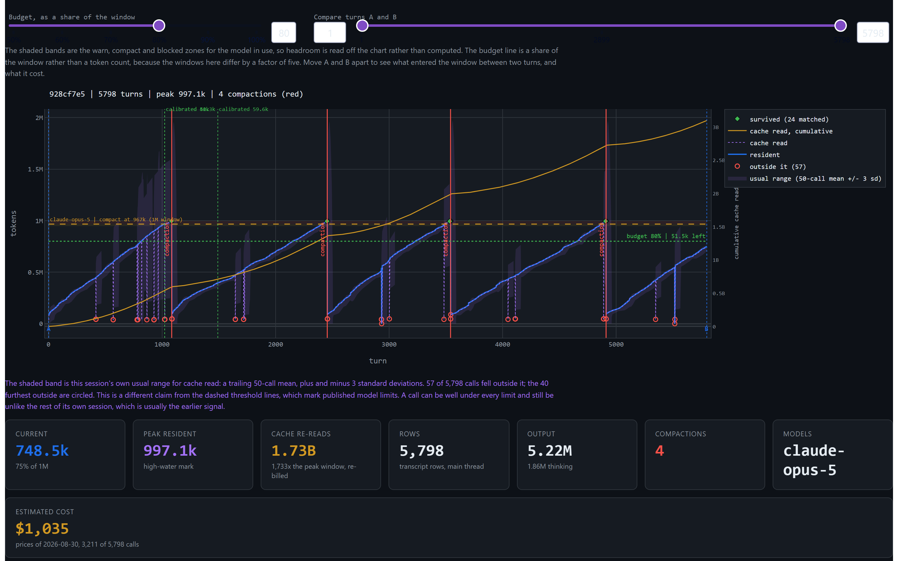
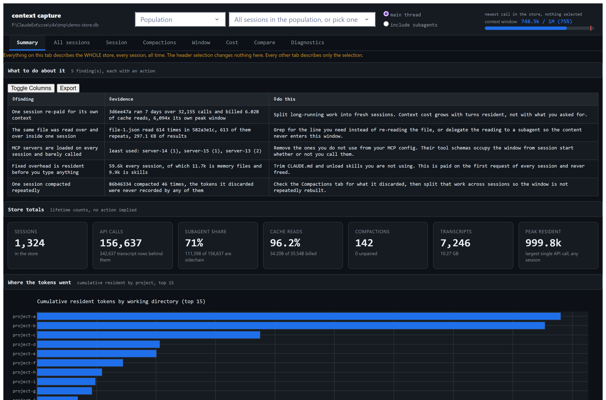
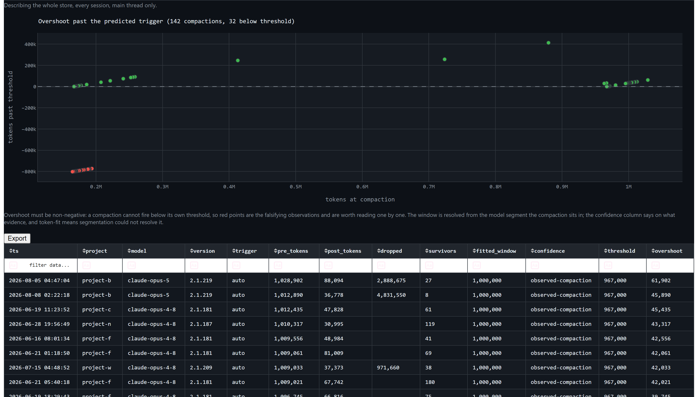
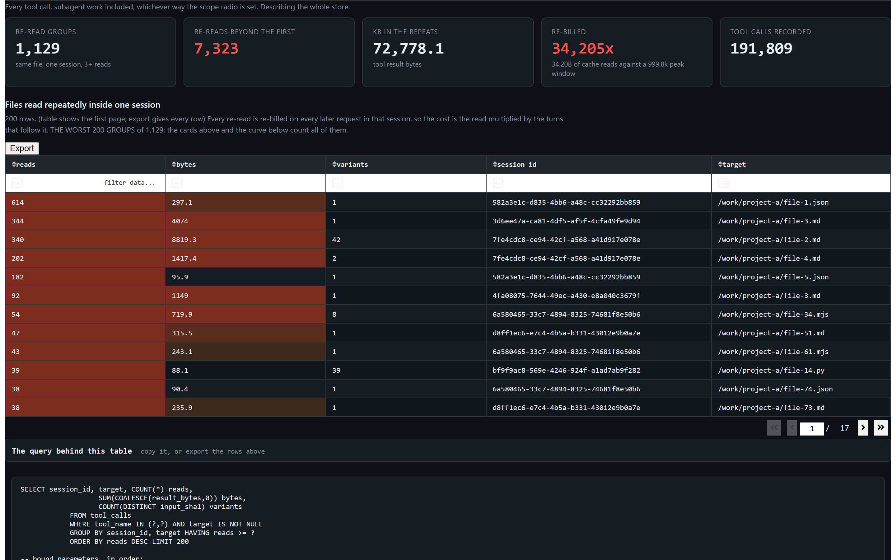
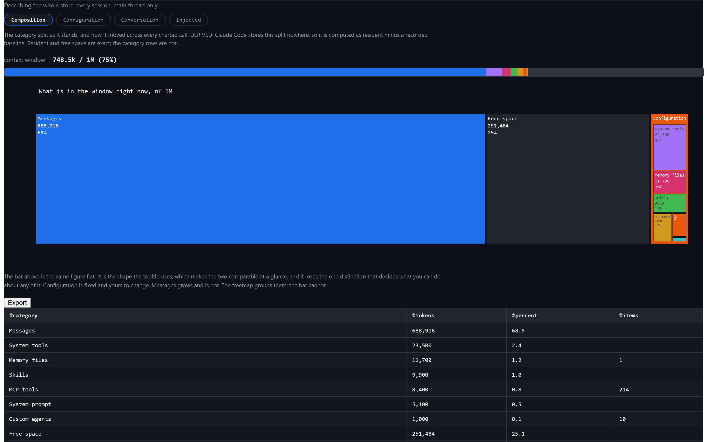

# c4x: context window capture

Claude Code shows you one number: a percentage in the context bar. Everything behind it is
discarded at render time, so when a compaction fires you cannot see what it dropped, and you cannot
see it coming. **c4x** records that state into a local SQLite store as you work, and mirrors Claude
Code's own window arithmetic closely enough to say when the next compaction will fire. Install is
three commands and pulls nothing from npm.

> Everything stays in `data/context.db` on your disk. While it is installed it captures, and there
> is no off switch short of `node tools/install.mjs uninstall`. [Why.](#does-this-send-anything-anywhere)



<sub>Every screenshot here is a real store of 1,324 sessions, with working directories, file names
and message text replaced by `tools/redact.py`. Every number, chart and finding is untouched.</sub>

---

## Install

**Requirements**

- **Node 24 or newer.** Every tool opens the store through the built-in `node:sqlite`, which
  earlier majors shipped behind a flag.
- **Python 3.11 or newer**, for the dashboard and the CLI only. Capture itself needs neither.
- **Nothing from npm.** No dependencies, no lockfile to audit.

```bash
git clone https://github.com/TranDenyDFW/claude-code-context-capture
cd claude-code-context-capture
node tools/install.mjs install
```

That writes this checkout's hooks and status line into `~/.claude/settings.json` and records exactly
what it changed in `data/install-receipt.json`. It converges rather than overwrites, so running it
twice changes nothing and running it over a broken config repairs it. The hooks take effect in
sessions already running, and your existing transcripts are captured on the first harvest, so the
store is not empty on day one.

```bash
node tools/install.mjs install --dry-run   # print the exact diff, write nothing
pip install -r requirements.txt            # dashboard and CLI only
```

**Check it worked.** This is the step worth not skipping, because the tool hooks into another
program's lifecycle and a silent failure there looks exactly like a quiet week:

```bash
node tools/install.mjs status
```

```
install root : /path/to/claude-code-context-capture
settings     : /home/you/.claude/settings.json
store        : /path/to/claude-code-context-capture/data/context.db
receipt      : written 2026-08-28T19:26:22.167Z
HEALTHY
```

Exit code 0 is healthy, 1 is drifted, 2 is misuse, so it can gate a script.

**Updating.** `git pull` then `node tools/install.mjs install` to re-converge. Your store is left
alone: upgrades add columns in place and never rewrite existing rows.

**Turning it off.** `node tools/install.mjs uninstall` removes only this tool's entries and keeps
the store. Add `--purge` to delete the store as well.

---

## Examples

Each of these runs against data you already have, your own transcripts under `~/.claude/projects`,
with no setup beyond the install above.

### Confirm it captured something

```bash
node tools/harvest.mjs --stats
```

```json
{
  "db": "/path/to/data/context.db",
  "files": { "n": 7246, "bytes": 11026710459 },
  "sessions": 1324,
  "turns": { "n": 342522, "max_resident": 999798 },
  "api_calls": { "n": 156579, "rows_behind_them": 342391 }
}
```

`api_calls` is the number that matters. A streamed assistant message is written as several
transcript rows sharing one request id, so 342,522 rows are 156,579 real API calls. Summing the
rows would count the same call two to eight times, which is the easiest mistake to make against
this store and the reason the deduped view exists.

### List your sessions

```bash
python -m c4x.cli sessions --limit 5
```

```
session_id  title                                         project                turns  current   peak    compactions
928cf7e5    Status line documentation accuracy            /work/c4x               7425   670569   997078            4
ed1902c7    Economic policy impact on prices and markets  /work/secdb             5986   744642   997778            2
4fa08075    Claude extensions and GitHub issues folder    /work/extindex         31982   429257   966014            2
```

`current` is the last reading, `peak` is the high-water mark. A session can sit at 670k having
touched 997k earlier, which is the difference the context bar alone cannot show you.

### Open the dashboard

```bash
python app.py
```

Visit `http://127.0.0.1:8056/`. Use `--port` or `C4X_PORT` to move it. Closing the dashboard does
not stop capture: the hooks keep recording whether or not it is running.



Every finding is clickable. Clicking one selects the session it names and jumps to the tab that
proves it, so a claim on the front page is one click from its evidence.

### See where the window went

The Session tab is the chart at the top of this README: growth per turn, every compaction marked in
red, the model's warn and blocked zones shaded, and the predicted trigger drawn as a line. Pick a
session in the header, or click a row on All sessions.

The same view without a browser:

```bash
python -m c4x.cli dump --tab tab-session --session 928cf7e5-287f-4300-a03f-347d17719ae8
```

### Find out when the next compaction fires

```bash
node tools/mirror.mjs --predict 850000 --window 1000000
```

```json
{
  "reported_threshold": 967000,
  "trigger_threshold": 967000,
  "warn_at": 947000,
  "blocked_at": 997000,
  "level": "ok",
  "pctLeft": 12,
  "tokens_until_compact": 117000
}
```

The arithmetic comes from `tools/mirror-core.mjs`, the same module the dashboard draws its
threshold lines from, so the number here and the line on the chart cannot drift apart.

### Read what a compaction threw away

```bash
python -m c4x.cli dump --tab tab-compactions
```

```
ts                   trigger  pre_tokens  post_tokens  dropped    survivors  threshold  overshoot
2026-08-05 04:47:04  auto        1028902        88094   2888675          27     967000      61902
2026-08-08 02:22:18  auto        1012890        36778   4831550           8     967000      45890
```

`overshoot` is how far past the predicted trigger the session actually got. Clicking a row opens
the summary the compaction wrote, in full, plus the messages that are absent from its survivor
list, recovered from the store rather than reconstructed.



### See what you paid for twice

```bash
node tools/waste.mjs --duplicates
```

```
duplicate reads (>= 3 reads of one file in one session)
  groups: 1129   re-reads beyond the first: 7323   bytes in the repeats: 72778.4 KB

    614x     297.1 KB  identical     582a3e1c  /work/categories.json
    344x    4074.0 KB  identical     3d6ee47a  /work/staging/_BATCH_BRIEF.md
    340x    8819.3 KB  42 variants   7fe4cdc8  /books/_standards_catalog.md
```

`variants` is how a re-read hides: the same file reached by 42 different spellings of its path. The
Cost tab adds the shape of it, a cumulative curve answering whether ten fixes would end most of the
re-reading or none of it, and a second table for identical tool inputs repeated **across** sessions,
which no per-session view can see.



Cost is an estimate and says so, from a price table committed at `c4x/prices.json` and refreshed by
CI against two published sources that have to agree. A model with no entry renders blank, never
zero.

### Compare two populations

```bash
python -m c4x.cli dump --tab tab-compare --compare-with ed1902c7-ce5c-4495-87b3-f416086dba64
```

Both arms are measured by the same function, so a difference cannot be an artefact of asking two
different questions. Each row declares whether it scales with population size, because comparing 3
sessions against 303 makes every total larger for a reason that says nothing.

### Query the store yourself

Every table on the page prints the query that produced it, and so does the dump:

```bash
python -m c4x.cli dump --tab tab-cost | grep -A 12 "The query behind"
sqlite3 data/context.db
```

Add `--json` for the same content machine-readably. The dashboard is a convenience over an ordinary
SQLite file, not a gatekeeper on it.

---

## The eight tabs

`python -m c4x.cli tabs` lists these. The CLI renders the same callbacks the browser renders, so a
dump is what the page shows rather than a parallel implementation of it.

| Tab | Dump it |
|---|---|
| Summary | `python -m c4x.cli dump --tab tab-summary` |
| All sessions | `python -m c4x.cli dump --tab tab-sessions` |
| Session | `python -m c4x.cli dump --tab tab-session --session <id>` |
| Compactions | `python -m c4x.cli dump --tab tab-compactions --session <id>` |
| Window | `python -m c4x.cli dump --tab tab-window --session <id>` |
| Cost | `python -m c4x.cli dump --tab tab-cost --session <id>` |
| Compare | `python -m c4x.cli dump --tab tab-compare --compare-with <id>` |
| Diagnostics | `python -m c4x.cli dump --tab tab-diagnostics` |

`python -m c4x.cli all` sweeps every tab at once, which is the fastest way to ask "did anything
break". Three things worth finding that the examples above did not reach: the Window tab's treemap
of what is in the context right now, item by item; subagent identity, which records what kind of
agent ran and which turns it spawned; and dragging a box on a chart to filter the table beside it.



---

## Does this send anything anywhere?

No. Nothing leaves the machine, there is no network call in the capture path, and `data/` is
gitignored.

**The store keeps the text of your conversations, not just their sizes.** That is what makes a
compaction summary readable instead of a character count, and what makes a dropped message
recoverable at all. It is also the thing to know before you install rather than after.

There is no off switch on purpose. A capture tool you can quietly disable still produces a store
that *looks* complete, and nothing in it tells you which sessions were recorded and which were not.
`node tools/install.mjs uninstall` is the way to stop it, and `--purge` deletes what it collected.

---

## Docs

The dashboard explains itself as you use it: every column carries a tooltip saying what it means,
every table carries the SQL behind it, and every derived figure says on the page that it is
derived rather than measured.

Beyond that there are two things worth reading. Every tool prints its own usage, and
`node tools/install.mjs --help` in particular explains why the installer converges instead of
scripting. And [docs/architecture.md](docs/architecture.md) covers the three stages, where the
data lives, the one invariant that catches everyone, and why the category breakdown is derived
rather than read.

## License

MIT
