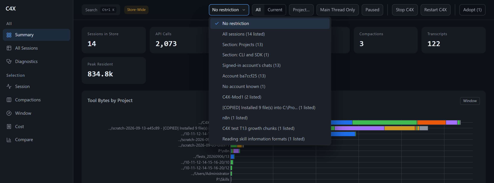

# c4x

Claude Code and the Claude desktop app keep your chats in places you cannot see, and they lose
them more easily than you would think. c4x runs beside them on your machine and puts you back
in charge of your chats.

**Status: beta.** Windows, with the Claude desktop app. Nothing leaves your machine: everything
c4x keeps lives under `data/` in this folder. [What it keeps.](#what-it-keeps)

## What it does for you

- **Use another account when one runs out, and keep every chat.** Sign into your second
  account and the chat list is the same: the same chats, the same history, in the desktop app
  and here. Each chat remembers which account made it, so you can still see only yours.
- **Get chats back the app lost.** After a reinstall the desktop app forgets chats that are
  still on your disk. c4x lists them and puts them back, folder by folder.
- **Move a project to another machine.** One file carries a folder's chats, their memory and
  the app's own records, and the project opens in Claude Code over there.
- **Search every chat you ever had**, across accounts and folders, and open any of them.
- **Know when Claude is about to forget.** A warning before a compaction, and a copy of what it
  drops.



## Install

Download `c4x-windows.zip` from the
[latest release](https://github.com/TranDenyDFW/claude-code-context-capture/releases), unzip it,
and run `c4x.exe`. Nothing else is needed: the folder carries the program and the Node it uses.

Unzip it somewhere that is yours and stays put, `%USERPROFILE%\c4x` for example. **Not** under
`%APPDATA%` or `%LOCALAPPDATA%`: the Claude desktop app's Store build redirects writes under those
directories into its own package folder, so a copy that lives there is not quite where it says it
is. Windows will warn that the program is unrecognised the first time, because it is not signed:
**More info**, then **Run anyway**.

The first run wires the hooks into Claude, starts the dashboard and opens it. After that:

```
c4x status        is it wired, is it capturing
c4x harvest       read the transcripts into the store now
c4x uninstall     unwire it, keeping the store
c4x --help        the rest
```

Any flags after a verb go to the tool that does the work, so `c4x install --no-dashboard` and
`c4x harvest --stats` behave exactly as the underlying tools always have.

### From source

Needs Node 24 or newer, and Python 3.12 or newer for the dashboard.

```bash
git clone https://github.com/TranDenyDFW/claude-code-context-capture
cd claude-code-context-capture
node tools/install.mjs install
pip install -r requirements.txt
node tools/install.mjs status
```

The dashboard is at `http://127.0.0.1:8059/` either way. It starts with Claude and stops itself a
minute after Claude closes. `c4x uninstall`, or `node tools/install.mjs uninstall` from a
checkout, removes it and keeps your data.

## Switching accounts

The header has **All** and **Current**.

- **All**: every account signed into this machine sees every chat. This is the one to pick when
  an account runs out and you want to carry on under another.
- **Current**: each account goes back to its own chats. It asks first.
- Quit Claude before you switch, start it again after. The desktop app reads its chat list when
  it starts.
- A new account, or an old account with a new organisation, is covered on its own the next time
  Claude closes. If you closed Claude already, press **Cover now**.
- The list at the top of the page has **Signed-in account's chats**: only the chats made under
  the account you are signed in as, and one entry per account.
- One rule: finish a chat under the account it started with. Switch between chats, not in the
  middle of one, or the next reply pays for the whole conversation again.

## Chats the app lost

**Adopt** in the header opens a table of every chat on this machine the desktop app has no
record of, one row per folder, with a search box to find a folder or a chat by name. Tick the
folders you want back and restart Claude. Chats you deleted in the app stay out of the list, so
you do not bring them back by accident.

## Moving a project to another machine

```bash
python -m c4x.projects export "P:\Work\Thing" --out thing.db
python -m c4x.projects import thing.db --into "D:\Elsewhere\Thing"
```

The export carries the folder's chats, the project memory, the trust setting and the desktop
app's records. `--dry-run` on the import lists every file it would write before writing any.

## What it keeps

- Nothing leaves the machine. c4x makes no network call while it captures or serves the
  dashboard, and `data/` is ignored by git.
- The text of your conversations is kept, not only their sizes. That is what makes a lost chat
  recoverable at all.
- A copy of each transcript is taken just before Claude compacts it, so nothing it drops is gone.
- There is no off switch while it is installed. `node tools/install.mjs uninstall` is the way to
  stop it.

## More

- [docs/dashboard.md](docs/dashboard.md): every tab and control on the dashboard.
- [docs/desktop-records.md](docs/desktop-records.md): how accounts, records and sharing work.
- [docs/architecture.md](docs/architecture.md) and [docs/performance.md](docs/performance.md).
- [CHANGELOG.md](CHANGELOG.md): what changed and when.

## License

MIT
